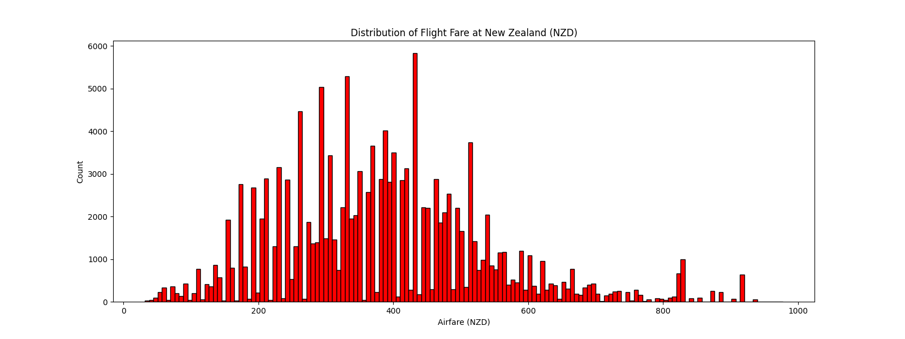
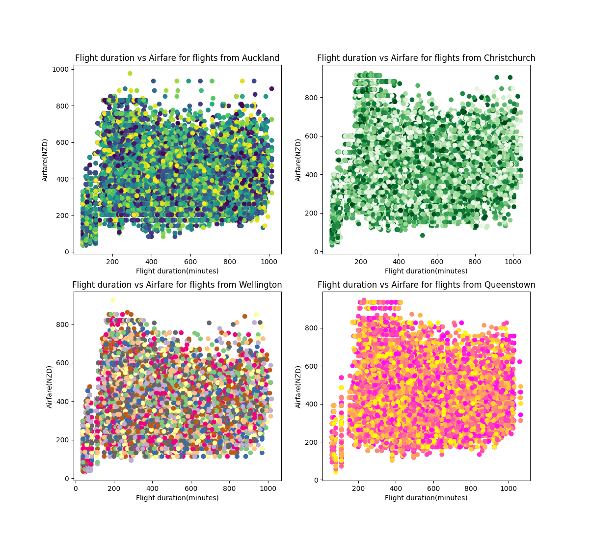
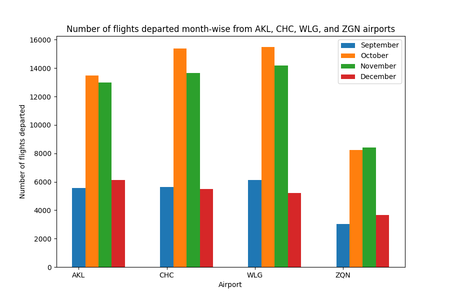
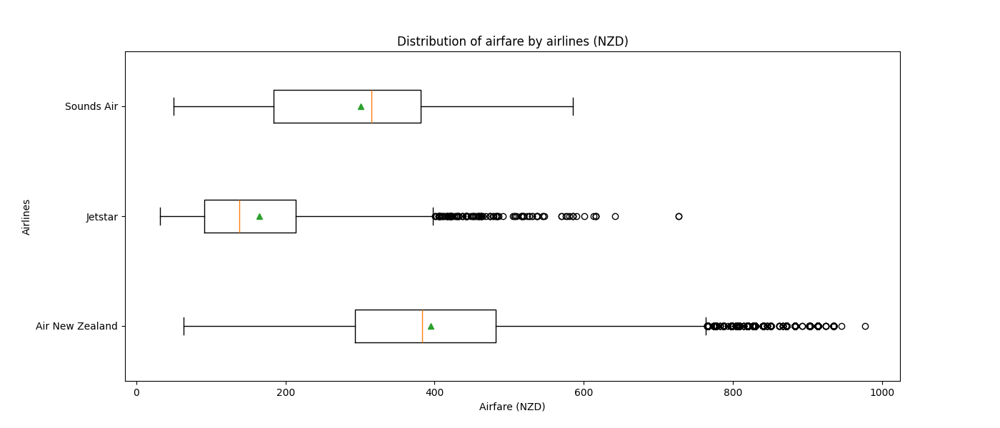
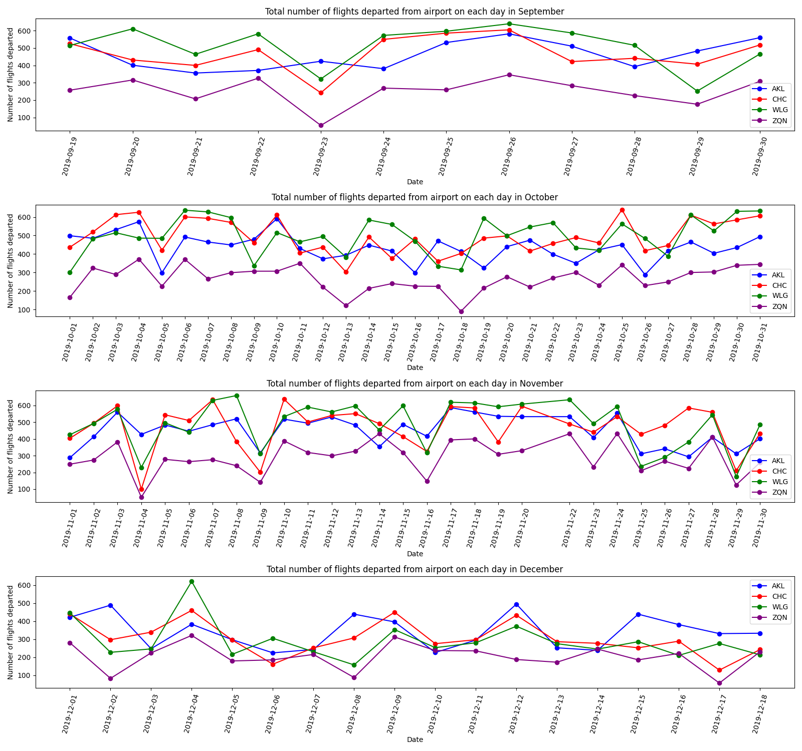

# Data Analysis of airfares in New Zealand✈️
This project analyses the airfares of the flights operating within New Zealand in the last quarter in 2019 from the dataset. The goal is to clean the dataset, perform exploratory data analysis, data visualizations, and finding insights from the cleaned dataset.🛫

  
  
  
  

## Dataset🗂️
- Source: Kaggle 
- Source url: https://www.kaggle.com/datasets/shashwatwork/airfares-in-new-zealand

## Kaggle Notebook📓
https://www.kaggle.com/code/reshmaharidhas/data-cleaning-eda-visualization-of-airfares-in-nz

## Insights✈️
- The price range of air travel in New Zealand is between 30 to 950 NZD.
- Most of the airfares for the direct flights in New Zealand is around 180 NZD.
- The airfare for direct flights ranges between 30 NZD to 560 NZD.
- Most of the departing flights from both the North island and the South island have the price around 400 NZD.
- Most of the airfare for flights operating within the North island are between 400 to 500 NZD, and around 810 NZD.
- Most of the airfare for flights operating within the South island are between 300 to 500 NZD.
- The flight route from Auckland(AKL) to Nelson airport(NSN) through a stop-over at Wellington(WLG) has the most number of flights in New Zealand.
- The shortest flight duration in New Zealand is 60 minutes.
- Sunday and Wednesday has the most number of flights operated which is above 21000.
- Air New Zealand has the maximum number of flights operated in New Zealand which is above 135000 flights.
- September had the least number of flight departures from AKL, CHC, WLG, and ZQN airports which is less than 6000 flights.
- In Queenstown airport, the number of flights departed in the month of November is higher than October.
- Christchurch airport (CHC) had the highest number of arrivals from Auckland airport (AKL) which is nearly 6000.
- Wellington airport had highest number of flight departures on 8th and 22nd of November 2019.
- Auckland airport (AKL) has the highest number of transits.
- IVC airport had the least number of transits.
- The average airfare is less on Monday and Tuesday for nearly 330 NZD.
- Most of the lowest airfare flights have the departure time between 6 to 12 hours with a price ranging between 270 to 380 NZD.
- The early morning flights departing between 0 to 6 hours sometimes has cheap ticket rate around 50 to 100 NZD.
- The average airfare of all airlines are higher on Sunday than on Saturday.
- The top 10 routes having highest airfares are not direct flights, and they have 1 stop-over.
- The top 5 cheapest routes by average airfare are direct flights with no stop-over.
- The top 5 most operated routes by Jetstar are direct flights.

## Visualizations🛫

## Tech stack
- Pandas
- Matplotlib
- Python
- Numpy

## License
GPL 3.0
